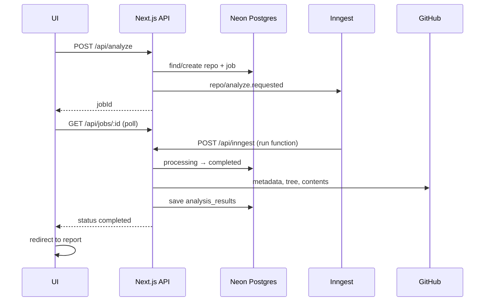

# RepoPulse

RepoPulse analyzes **public GitHub repositories** asynchronously and produces a structured report dashboard — metrics, language breakdown, architecture signals, TODO/FIXME scan, and job history. Built as a production-style MVP for **Vercel + Neon + Inngest**.

## Overview

1. Submit a GitHub repository URL on the homepage.
2. A background job fetches repo metadata, file tree, and scannable file contents from GitHub.
3. Pure analysis functions build a report; results persist in Postgres.
4. Poll the job status page, then view the repository summary and full report dashboard.

## Architecture

```
src/
  app/              → Next.js pages + thin API route handlers
  components/       → UI only (client + server components)
  lib/              → db, github, inngest, validators, env helpers
  server/
    repositories/   → database access only
    services/       → business logic
    workflows/      → analysis orchestration (Inngest steps)
    mappers/        → row ↔ domain transformations
    analysis/       → pure analysis functions
    api/            → shared API helpers + route segment config
  types/            → shared domain and API types
```

### Async analysis flow



## Stack

| Layer | Technology |
|-------|------------|
| Frontend | Next.js 16 App Router, React 19, Tailwind CSS 4 |
| API | Next.js Route Handlers (Node.js runtime) |
| Database | Neon Postgres + Drizzle ORM (`neon-http` driver) |
| Jobs | Inngest v4 |
| Validation | Zod v4 |
| Deploy | Vercel |

## Local setup

### Prerequisites

- Node.js 20+
- A [Neon](https://neon.tech) Postgres database
- [Inngest Dev Server](https://www.inngest.com/docs/local-development) for background jobs

### Steps

```bash
npm install
cp .env.example .env.local
# Fill in DATABASE_URL (and optionally GITHUB_TOKEN)

# Apply schema (pick one approach — see Database section)
npm run db:migrate   # recommended for teams/production parity
# npm run db:push    # quick schema sync for solo local dev

# Terminal 1 — Next.js
npm run dev

# Terminal 2 — Inngest Dev Server
npx inngest-cli@latest dev
```

Open [http://localhost:3000](http://localhost:3000), submit a public repo (e.g. `https://github.com/vercel/next.js`), and follow the job monitor.

## Environment variables

| Variable | Required | Where | Description |
|----------|----------|-------|-------------|
| `DATABASE_URL` | Yes | Server | Neon Postgres URL. Use the **pooled** URL on Vercel. |
| `GITHUB_TOKEN` | Strongly recommended | Server | GitHub PAT for higher rate limits. Never use `NEXT_PUBLIC_`. |
| `INNGEST_EVENT_KEY` | Production | Server | Sends events via `inngest.send()`. Not needed for local dev. |
| `INNGEST_SIGNING_KEY` | Production | Server | Verifies Inngest requests to `/api/inngest`. |

See [`.env.example`](.env.example) for a annotated template.

## Database (Drizzle + Neon)

Schema lives in `src/lib/db/schema.ts`. Migrations are in `drizzle/`.

### First-time setup

```bash
# With DATABASE_URL set in .env.local:
npm run db:migrate
```

This applies `drizzle/0000_init.sql` to your Neon database.

### Schema changes (development workflow)

```bash
# 1. Edit src/lib/db/schema.ts
# 2. Generate a migration
npm run db:generate -- --name describe_your_change

# 3. Review SQL in drizzle/
# 4. Apply locally
npm run db:migrate
```

### `db:push` vs `db:migrate`

| Command | Use when |
|---------|----------|
| `npm run db:migrate` | **Production**, CI, and team environments. Applies versioned SQL migrations. |
| `npm run db:push` | Solo local prototyping only. Pushes schema diff directly without migration files. |

### Production / Vercel

Run migrations against your Neon database **before or during** the first deploy:

```bash
DATABASE_URL="postgresql://..." npm run db:migrate
```

Or add a CI step / Neon branch workflow. Do **not** rely on `db:push` in production.

**Neon tip:** On Vercel, use the connection string with `-pooler` in the hostname for serverless-friendly connection pooling.

## Inngest

### Local development

1. Start Next.js: `npm run dev` (default port 3000).
2. Start the dev server: `npx inngest-cli@latest dev`.
3. The dev server discovers your app at `http://localhost:3000/api/inngest` and registers functions automatically.
4. `INNGEST_EVENT_KEY` and `INNGEST_SIGNING_KEY` are **not** required locally.

### Production (Vercel)

1. Deploy RepoPulse to Vercel with env vars set (see below).
2. In [Inngest Cloud](https://app.inngest.com), create an app (or use existing).
3. **Sync the app URL:** `https://<your-vercel-domain>/api/inngest`
4. Copy **Event Key** → `INNGEST_EVENT_KEY` and **Signing Key** → `INNGEST_SIGNING_KEY` in Vercel env settings.
5. Redeploy so the keys are available at runtime.

### Function timeout note

The analyze workflow runs inside `/api/inngest` with `maxDuration = 300` (5 minutes). This requires **Vercel Pro** (or higher) for timeouts above 60 seconds. On Hobby, large repositories may hit the function timeout — consider upgrading or splitting the workflow into smaller Inngest steps.

## GitHub token & rate limits

RepoPulse calls the GitHub REST API for repo metadata, git trees, and up to 200 file contents per analysis.

| Auth | Rate limit (approx.) |
|------|----------------------|
| Unauthenticated | 60 requests/hour per IP |
| `GITHUB_TOKEN` set | 5,000 requests/hour per token |

**Recommendations for production:**

- Create a fine-grained PAT with **read-only** access to public repositories (Contents: Read, Metadata: Read).
- Set `GITHUB_TOKEN` in Vercel as a **server** env var (never `NEXT_PUBLIC_GITHUB_TOKEN`).
- Without a token, shared Vercel egress IPs can exhaust the 60/hr limit quickly.
- Very large repos may return a truncated tree; the report notes partial metrics. File fetches skip 404s and files over 1 MB.

## Scripts

| Command | Description |
|---------|-------------|
| `npm run dev` | Start Next.js dev server |
| `npm run build` | Production build |
| `npm run start` | Start production server |
| `npm run lint` | ESLint |
| `npm run db:generate` | Generate Drizzle migration from schema |
| `npm run db:migrate` | Apply pending migrations |
| `npm run db:push` | Push schema directly (local dev only) |
| `npm run db:studio` | Open Drizzle Studio |

## Deploy to Vercel

### Pre-deploy checklist

- [ ] Neon database created; `DATABASE_URL` uses pooled connection string
- [ ] Migrations applied: `npm run db:migrate`
- [ ] `GITHUB_TOKEN` set (server env)
- [ ] Inngest app synced to `https://<domain>/api/inngest`
- [ ] `INNGEST_EVENT_KEY` and `INNGEST_SIGNING_KEY` set in Vercel
- [ ] Vercel Pro (if analyzing repos that need >60s processing time)

### Deploy

1. Import the GitHub repo in Vercel.
2. Add environment variables from `.env.example`.
3. Deploy — Vercel auto-detects Next.js; no custom build command needed.
4. After first deploy, sync Inngest to the production `/api/inngest` URL.
5. Submit a test repo and confirm the job completes end-to-end.

## Runtime & security notes

- All API routes export `runtime = "nodejs"` and `dynamic = "force-dynamic"`.
- Server-only modules (`lib/db`, `lib/github/client`, `lib/api/server`, `lib/env/server`) import `server-only` to prevent accidental client bundling.
- No secrets use the `NEXT_PUBLIC_` prefix.
- Client components only import from `@/lib/api/client` (relative fetch to same-origin API routes).

## License

Private MVP — adjust as needed.
